# Analyse
JcB  
03/02/2016  


```
## 'data.frame':	134 obs. of  34 variables:
##  $ SX         : int  2 2 2 2 2 2 2 2 2 2 ...
##  $ AD         : int  2013 1999 1998 1981 2008 2013 2013 2004 2003 2011 ...
##  $ FORM       : int  2 1 2 2 2 2 2 1 1 2 ...
##  $ DHYP       : int  0 0 0 0 0 0 0 0 0 0 ...
##  $ DPAN       : int  0 0 0 0 0 0 0 0 0 0 ...
##  $ DACU       : int  0 1 0 0 0 0 0 1 1 0 ...
##  $ DTP        : int  0 0 0 0 0 0 0 0 0 0 ...
##  $ DHOM       : int  0 0 0 0 0 0 0 0 0 0 ...
##  $ DSOP       : int  0 0 0 0 0 0 0 0 0 0 ...
##  $ DRELAX     : int  0 0 0 0 0 0 0 0 0 0 ...
##  $ ACU        : int  0 5 0 6 0 0 2 3 7 2 ...
##  $ HOM        : int  0 0 0 8 0 0 6 0 0 2 ...
##  $ BAIN       : int  2 3 4 2 1 3 1 2 8 1 ...
##  $ TC         : int  1 1 1 1 2 2 3 1 6 1 ...
##  $ Tma        : int  3 4 0 5 0 4 5 4 5 2 ...
##  $ Tme        : int  0 0 0 3 0 0 7 0 2 0 ...
##  $ TR         : int  1 2 2 4 2 1 4 6 10 1 ...
##  $ MED        : int  1 6 3 7 1 5 0 5 9 3 ...
##  $ NB         : int  5 6 4 8 4 5 7 6 7 7 ...
##  $ SPA        : int  1 1 0 2 1 1 1 1 5 1 ...
##  $ PARA       : int  1 2 0 1 0 1 2 1 5 1 ...
##  $ COD        : int  0 0 0 0 0 0 0 0 0 0 ...
##  $ NUB        : int  0 0 0 0 2 2 3 0 1 0 ...
##  $ PEC        : int  2 1 2 2 4 2 4 1 2 2 ...
##  $ AMFORM     : int  1 1 1 1 1 1 1 1 1 1 ...
##  $ QFORMACU   : int  1 0 1 0 1 1 1 1 0 0 ...
##  $ QFORMHYP   : int  0 1 1 1 1 0 0 0 1 1 ...
##  $ QFORMSOPHRO: int  0 0 0 0 0 0 1 1 0 0 ...
##  $ QFORMTP    : int  1 0 0 0 0 1 0 0 0 0 ...
##  $ QFORMHAPTO : int  0 0 0 0 0 0 0 0 0 0 ...
##  $ QFORMHOMEO : int  1 0 1 0 0 1 1 0 1 1 ...
##  $ QFORMRELAX : int  0 1 0 0 0 1 0 0 0 0 ...
##  $ PP         : int  0 0 0 0 0 0 1 1 0 0 ...
##  $ TYP        : Factor w/ 3 levels "type 1","type 2",..: 3 2 3 3 NA 2 2 2 2 2 ...
```

Sexe
====


```

FEMME HOMME 
  131     3 
```
La disproportion entre les sexe n'autorise pas sz comparaison sur ce critère.

Année d'obtention du diplôme
=============================
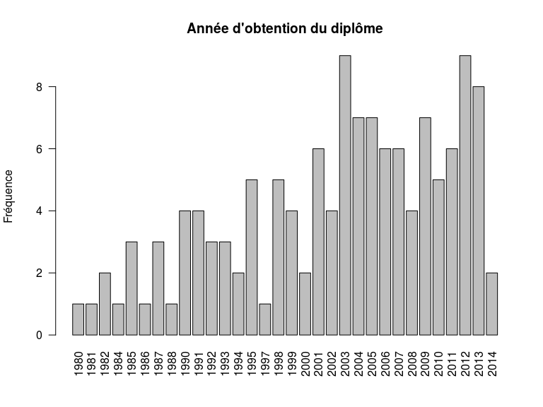

Formation ?
===========

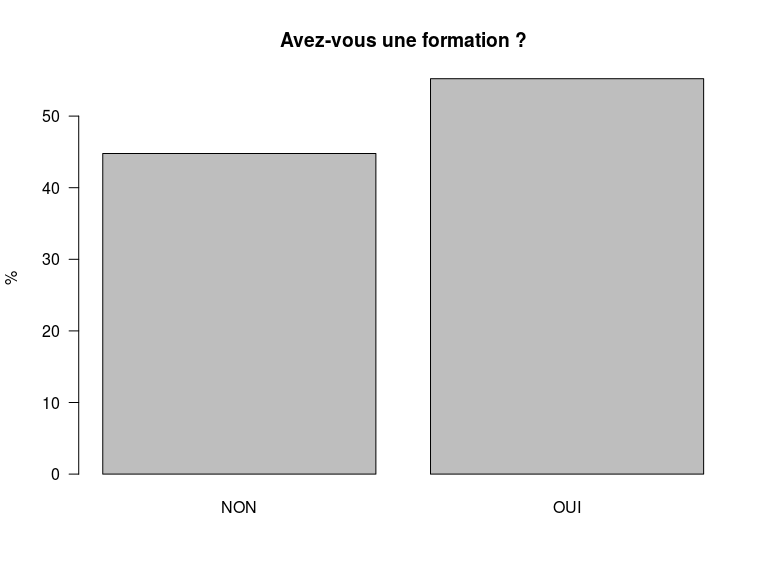

```

     NON      OUI 
44.77612 55.22388 
```

Préférences
===========

Nombre de méthodes utilisées (NB) par chaque sage-femme. 
--------------------------------------------------------


```

 1  3  4  5  6  7  8 
 1  3 22 26 33 32 16 
```

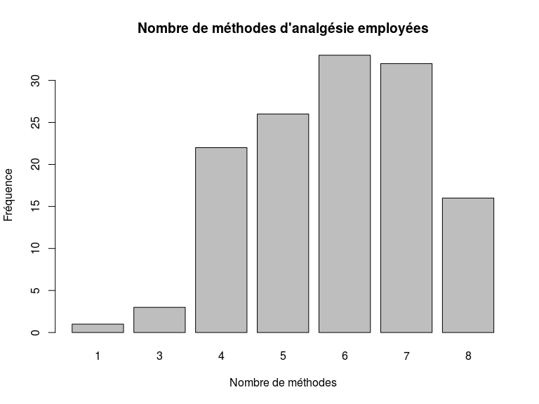

Acupuncture (ACU)


```

 0  1  2  3  4  5  6  7  9 
43  9 20 22 13 11 12  2  1 
```

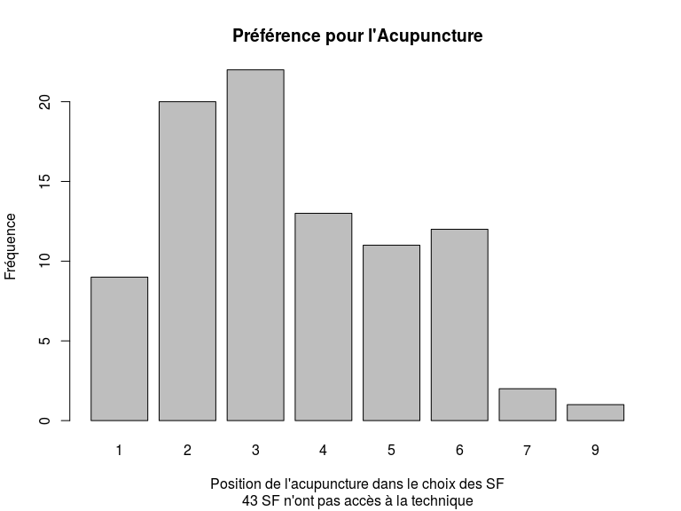

Homéopathie (HOM)

```

 0  1  2  3  4  5  6  7  8 
78  6  8  7 14  7  4  4  5 
```

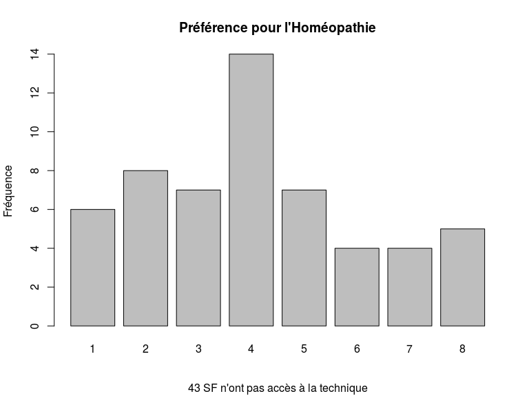

Bain (BAIN)

```

 0  1  2  3  4  5  6  8 
18 29 38 31  9  5  2  1 
```

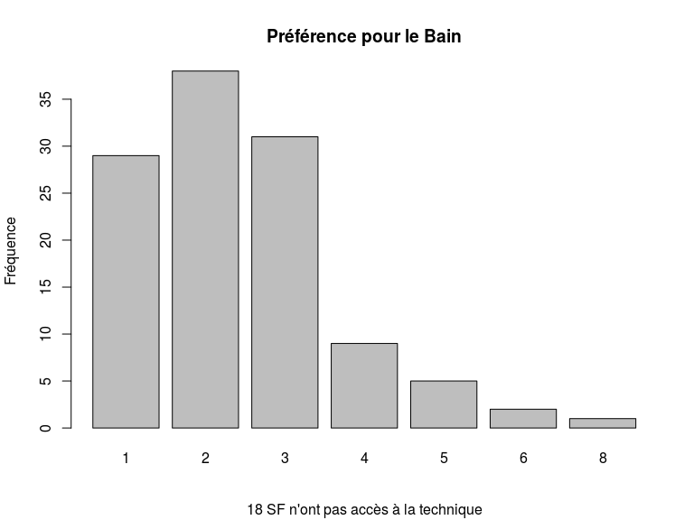

Techniques corporelles (TC)

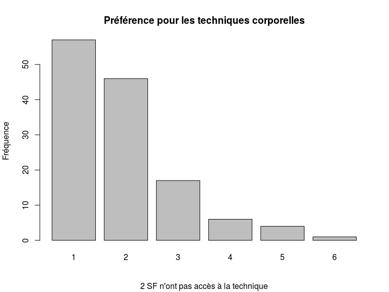

Techniques manuelles

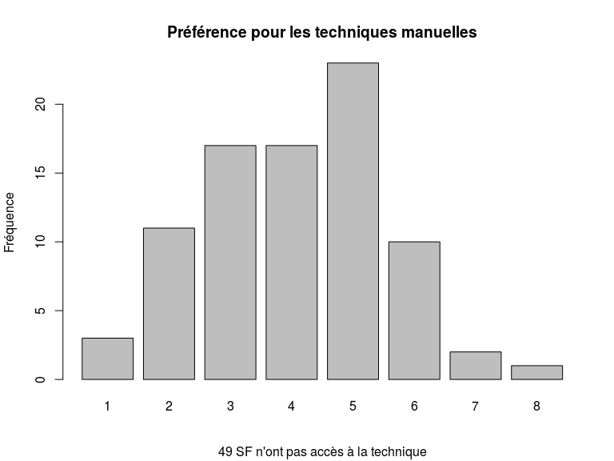

Techniques mentales

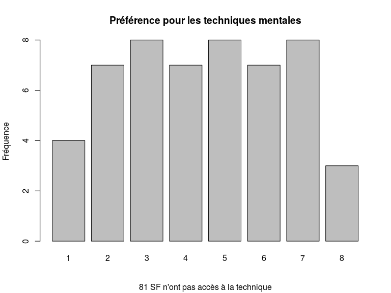

Techniques de respiration

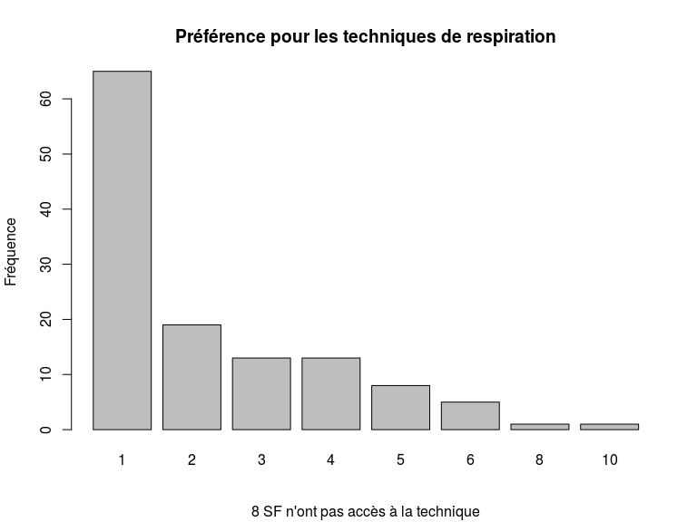

Techniques médicamenteuses

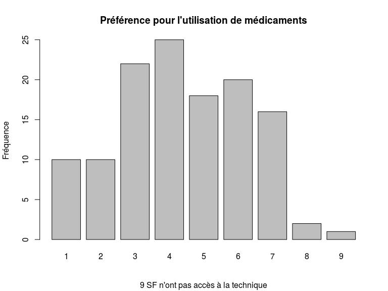

Synthèse
---------


Pour chaque technique, on compte le nombre de fois où elle est mise en 1


Choix 1

```
  TR   TC BAIN  MED  ACU  HOM  Tme  Tma 
  65   57   29   10    9    6    4    3 
```

Choix 2

```
  TC BAIN  ACU   TR  Tma  MED  HOM  Tme 
  46   38   20   19   11   10    8    7 
```

Choix 3

```
BAIN  ACU  MED   TC  Tma   TR  Tme  HOM 
  31   22   22   17   17   13    8    7 
```

Si on analyse la technique préférée selon le nombre de techniques utilisées (NB)


Si une seule méthode est utilisée (1 cas)

```
 ACU  HOM BAIN   TC  Tma  Tme   TR  MED 
   1    0    0    0    0    0    0    0 
```

Si 3 méthodes sont utilisées ()

```
BAIN  ACU  Tme  MED  HOM   TC  Tma   TR 
   2    1    1    1    0    0    0    0 
```

Si 4 méthodes sont utilisées ()

```
  TC   TR BAIN  MED  ACU  HOM  Tma  Tme 
  13    9    4    3    0    0    0    0 
```

Si 5 méthodes sont utilisées ()

```
  TR   TC BAIN  MED  HOM  Tme  ACU  Tma 
  18   10    5    2    1    1    0    0 
```

Si 6 méthodes sont utilisées ()

```
  TR   TC BAIN  MED  ACU  HOM  Tma  Tme 
  17   14    5    2    1    1    1    0 
```

Si 7 méthodes sont utilisées ()

```
  TR   TC BAIN  HOM  ACU  Tma  Tme  MED 
  17   13    8    4    3    1    1    0 
```

Si 8 méthodes sont utilisées ()

```
  TC BAIN   TR  ACU  MED  Tma  Tme  HOM 
   7    5    4    3    2    1    1    0 
```

Si moins de 4 méthodes sont utilisées, BAIN et ACU sont les méthodes les plus utilisées.

A partir de 4 techniques ou plus, les techniques comportementales et respiratoires sont les plus utilisées.

Relation technique, Année du diplôme
=====================================

Acupuncture
-----------


```

	Pearson's product-moment correlation

data:  as.numeric(names(t1)) and as.numeric(t1)
t = 2.9734, df = 30, p-value = 0.005762
alternative hypothesis: true correlation is not equal to 0
95 percent confidence interval:
 0.1540292 0.7080075
sample estimates:
      cor 
0.4770987 
```

Technique respiratoire
-----------------------
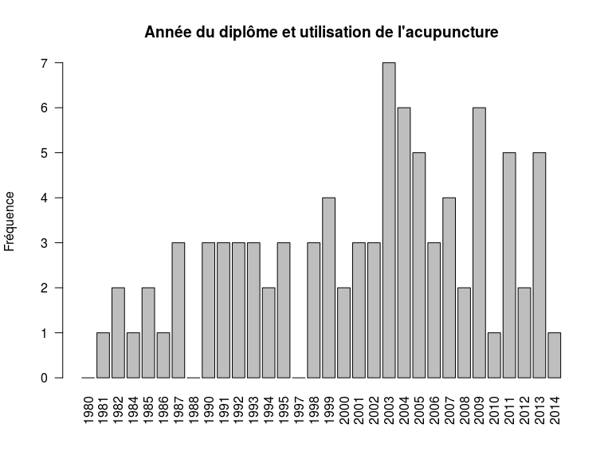

```

	Pearson's product-moment correlation

data:  as.numeric(names(t1)) and as.numeric(t1)
t = 5.3182, df = 30, p-value = 9.485e-06
alternative hypothesis: true correlation is not equal to 0
95 percent confidence interval:
 0.4595441 0.8410192
sample estimates:
      cor 
0.6966127 
```


Technique du bain
-----------------------


```

	Pearson's product-moment correlation

data:  as.numeric(names(t1)) and as.numeric(t1)
t = 5.771, df = 30, p-value = 2.649e-06
alternative hypothesis: true correlation is not equal to 0
95 percent confidence interval:
 0.5041400 0.8572169
sample estimates:
      cor 
0.7253281 
```

Technique comportementale
-----------------------


```

	Pearson's product-moment correlation

data:  as.numeric(names(t1)) and as.numeric(t1)
t = 5.2958, df = 30, p-value = 1.01e-05
alternative hypothesis: true correlation is not equal to 0
95 percent confidence interval:
 0.4572282 0.8401589
sample estimates:
      cor 
0.6951004 
```

Médications
-----------------------
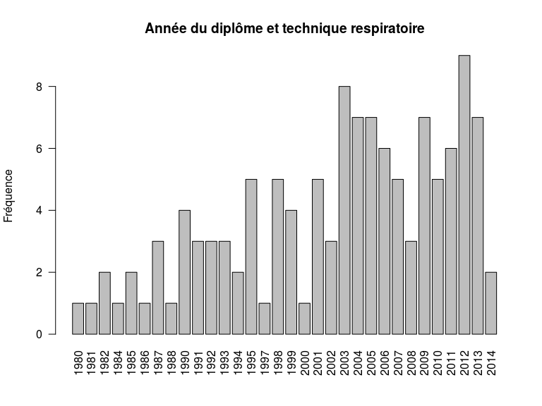

```

	Pearson's product-moment correlation

data:  as.numeric(names(t1)) and as.numeric(t1)
t = 5.1632, df = 30, p-value = 1.469e-05
alternative hypothesis: true correlation is not equal to 0
95 percent confidence interval:
 0.4432679 0.8349321
sample estimates:
      cor 
0.6859397 
```

Technique Manuelles
-----------------------
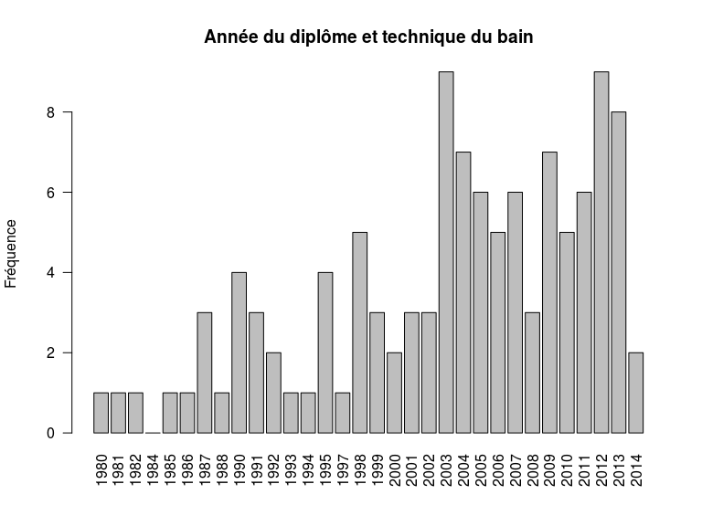

```

	Pearson's product-moment correlation

data:  as.numeric(names(t1)) and as.numeric(t1)
t = 5.7411, df = 30, p-value = 2.881e-06
alternative hypothesis: true correlation is not equal to 0
95 percent confidence interval:
 0.5013235 0.8562142
sample estimates:
     cor 
0.723537 
```

Technique mentales
-----------------------
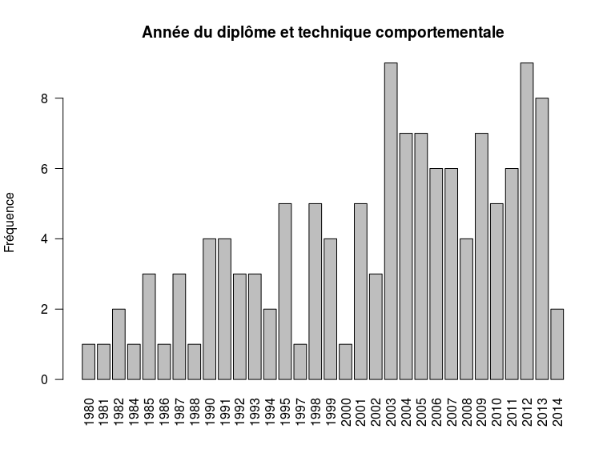

```

	Pearson's product-moment correlation

data:  as.numeric(names(t1)) and as.numeric(t1)
t = 3.0892, df = 30, p-value = 0.004301
alternative hypothesis: true correlation is not equal to 0
95 percent confidence interval:
 0.1720342 0.7171122
sample estimates:
      cor 
0.4912589 
```
