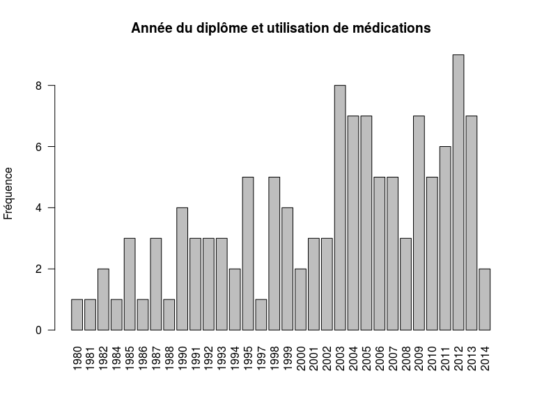
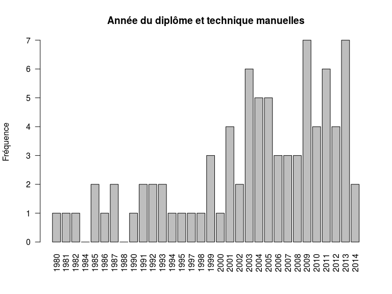
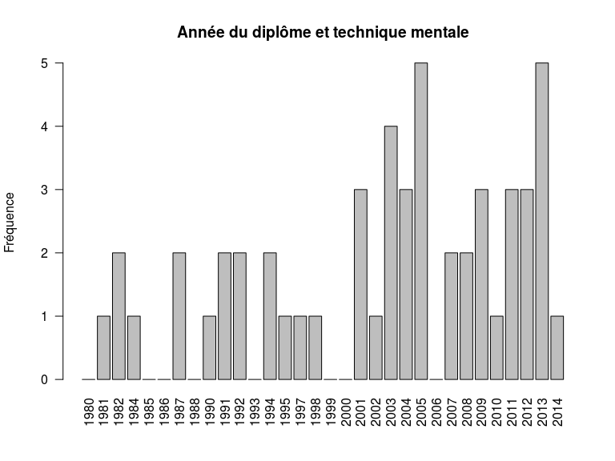
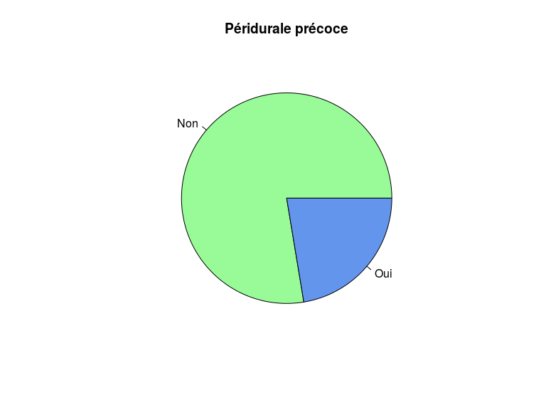

# Analyse
JcB  
03/02/2016  


```
## 'data.frame':	134 obs. of  34 variables:
##  $ SX         : int  2 2 2 2 2 2 2 2 2 2 ...
##  $ AD         : int  2013 1999 1998 1981 2008 2013 2013 2004 2003 2011 ...
##  $ FORM       : int  2 1 2 2 2 2 2 1 1 2 ...
##  $ DHYP       : int  0 0 0 0 0 0 0 0 0 0 ...
##  $ DPAN       : int  0 0 0 0 0 0 0 0 0 0 ...
##  $ DACU       : int  0 1 0 0 0 0 0 1 1 0 ...
##  $ DTP        : int  0 0 0 0 0 0 0 0 0 0 ...
##  $ DHOM       : int  0 0 0 0 0 0 0 0 0 0 ...
##  $ DSOP       : int  0 0 0 0 0 0 0 0 0 0 ...
##  $ DRELAX     : int  0 0 0 0 0 0 0 0 0 0 ...
##  $ ACU        : int  0 5 0 6 0 0 2 3 7 2 ...
##  $ HOM        : int  0 0 0 8 0 0 6 0 0 2 ...
##  $ BAIN       : int  2 3 4 2 1 3 1 2 8 1 ...
##  $ TC         : int  1 1 1 1 2 2 3 1 6 1 ...
##  $ Tma        : int  3 4 0 5 0 4 5 4 5 2 ...
##  $ Tme        : int  0 0 0 3 0 0 7 0 2 0 ...
##  $ TR         : int  1 2 2 4 2 1 4 6 10 1 ...
##  $ MED        : int  1 6 3 7 1 5 0 5 9 3 ...
##  $ NB         : int  5 6 4 8 4 5 7 6 7 7 ...
##  $ SPA        : int  1 1 0 2 1 1 1 1 5 1 ...
##  $ PARA       : int  1 2 0 1 0 1 2 1 5 1 ...
##  $ COD        : int  0 0 0 0 0 0 0 0 0 0 ...
##  $ NUB        : int  0 0 0 0 2 2 3 0 1 0 ...
##  $ PEC        : int  2 1 2 2 4 2 4 1 2 2 ...
##  $ AMFORM     : int  1 1 1 1 1 1 1 1 1 1 ...
##  $ QFORMACU   : int  1 0 1 0 1 1 1 1 0 0 ...
##  $ QFORMHYP   : int  0 1 1 1 1 0 0 0 1 1 ...
##  $ QFORMSOPHRO: int  0 0 0 0 0 0 1 1 0 0 ...
##  $ QFORMTP    : int  1 0 0 0 0 1 0 0 0 0 ...
##  $ QFORMHAPTO : int  0 0 0 0 0 0 0 0 0 0 ...
##  $ QFORMHOMEO : int  1 0 1 0 0 1 1 0 1 1 ...
##  $ QFORMRELAX : int  0 1 0 0 0 1 0 0 0 0 ...
##  $ PP         : int  0 0 0 0 0 0 1 1 0 0 ...
##  $ TYP        : Factor w/ 3 levels "type 1","type 2",..: 3 2 3 3 NA 2 2 2 2 2 ...
```

Sexe
====


```

FEMME HOMME 
  131     3 
```
La disproportion entre les sexe n'autorise pas sz comparaison sur ce critère.

Année d'obtention du diplôme
=============================


Formation ?
===========


```

     NON      OUI 
44.77612 55.22388 
```

Préférences
===========

Nombre de méthodes utilisées (NB) par chaque sage-femme. 
--------------------------------------------------------


```

 1  3  4  5  6  7  8 
 1  3 22 26 33 32 16 
```


```
   Min. 1st Qu.  Median    Mean 3rd Qu.    Max.    NA's 
   1.00    5.00    6.00    5.85    7.00    8.00       1 
```

Les SF utilisent entre 1 et 8 méthodes pour l'analgésie obstérricale. LA médiane se situe à 6, cela veut dire que 50% des SF utilisent moins de 6 méthodes et 50% plus de 6 méthodes.

### Acupuncture (ACU)


```

 0  1  2  3  4  5  6  7  9 
43  9 20 22 13 11 12  2  1 
```

```

    0     1     2     3     4     5     6     7     9 
32.33  6.77 15.04 16.54  9.77  8.27  9.02  1.50  0.75 
```


- 32% des SF n'ont pas accès à cette technique
- quand la technique est disponible, 7% des SF la citent en n°1

Homéopathie (HOM)

```

 0  1  2  3  4  5  6  7  8 
78  6  8  7 14  7  4  4  5 
```

```

    0     1     2     3     4     5     6     7     8 
58.65  4.51  6.02  5.26 10.53  5.26  3.01  3.01  3.76 
```


- 60% des SF n'ont pas accès à cette technique
- quand la technique est disponible, 4,5 % des SF la citent en n°1

Bain (BAIN)

```

 0  1  2  3  4  5  6  8 
18 29 38 31  9  5  2  1 
```


Techniques corporelles (TC)


```

    0     1     2     3     4     5     6 
 1.50 42.86 34.59 12.78  4.51  3.01  0.75 
```


- 1,5% des SF n'ont pas accès à cette technique
- quand la technique est disponible, 43 % des SF la citent en n°1

Techniques manuelles


```

    0     1     2     3     4     5     6     7     8 
36.84  2.26  8.27 12.78 12.78 17.29  7.52  1.50  0.75 
```


- 37% des SF n'ont pas accès à cette technique
- quand la technique est disponible, 2 % des SF la citent en n°1

Techniques mentales


```

    0     1     2     3     4     5     6     7     8 
60.90  3.01  5.26  6.02  5.26  6.02  5.26  6.02  2.26 
```


- 61% des SF n'ont pas accès à cette technique
- quand la technique est disponible, 3 % des SF la citent en n°1

Techniques de respiration


```

    0     1     2     3     4     5     6     8    10 
 6.02 48.87 14.29  9.77  9.77  6.02  3.76  0.75  0.75 
```


- 6% des SF n'ont pas accès à cette technique
- quand la technique est disponible, 49 % des SF la citent en n°1

Techniques médicamenteuses


```

    0     1     2     3     4     5     6     7     8     9 
 6.77  7.52  7.52 16.54 18.80 13.53 15.04 12.03  1.50  0.75 
```


- 7% des SF n'ont pas accès à cette technique
- quand la technique est disponible, 7,5 % des SF la citent en n°1

Synthèse
---------


Pour chaque technique, on compte le nombre de fois où elle est mise en 1


Choix 1

```
  TR   TC BAIN  MED  ACU  HOM  Tme  Tma 
  65   57   29   10    9    6    4    3 
```

Choix 2

```
  TC BAIN  ACU   TR  Tma  MED  HOM  Tme 
  46   38   20   19   11   10    8    7 
```

Choix 3

```
BAIN  ACU  MED   TC  Tma   TR  Tme  HOM 
  31   22   22   17   17   13    8    7 
```

Si on analyse la technique préférée selon le nombre de techniques utilisées (NB)


Si une seule méthode est utilisée (1 cas)

```
 ACU  HOM BAIN   TC  Tma  Tme   TR  MED 
   1    0    0    0    0    0    0    0 
```

Si 3 méthodes sont utilisées ()

```
BAIN  ACU  Tme  MED  HOM   TC  Tma   TR 
   2    1    1    1    0    0    0    0 
```

Si 4 méthodes sont utilisées ()

```
  TC   TR BAIN  MED  ACU  HOM  Tma  Tme 
  13    9    4    3    0    0    0    0 
```

Si 5 méthodes sont utilisées ()

```
  TR   TC BAIN  MED  HOM  Tme  ACU  Tma 
  18   10    5    2    1    1    0    0 
```

Si 6 méthodes sont utilisées ()

```
  TR   TC BAIN  MED  ACU  HOM  Tma  Tme 
  17   14    5    2    1    1    1    0 
```

Si 7 méthodes sont utilisées ()

```
  TR   TC BAIN  HOM  ACU  Tma  Tme  MED 
  17   13    8    4    3    1    1    0 
```

Si 8 méthodes sont utilisées ()

```
  TC BAIN   TR  ACU  MED  Tma  Tme  HOM 
   7    5    4    3    2    1    1    0 
```

Si moins de 4 méthodes sont utilisées, BAIN et ACU sont les méthodes les plus utilisées.

A partir de 4 techniques ou plus, les techniques comportementales et respiratoires sont les plus utilisées.

Relation technique, Année du diplôme
=====================================

Regroupement des années de diplome
----------------------------------

J'ai définit 4 périodes d'années de diplôme:

- 1980-1989 : étude en 3 ans
- 1990-2006 : étude en 4 ans
- 2007-2014 : étude en 5 ans, avec
- 2015-aujourd’hui : formation LMD (Licence Master Doctorat)


```
a
(1980,1989] (1989,2006] (2006,2014] 
         12          72          47 
```


Acupuncture
-----------


```

	Pearson's product-moment correlation

data:  as.numeric(names(t1)) and as.numeric(t1)
t = 2.9734, df = 30, p-value = 0.005762
alternative hypothesis: true correlation is not equal to 0
95 percent confidence interval:
 0.1540292 0.7080075
sample estimates:
      cor 
0.4770987 
```

Si on ne tient pas compte de l'ordre des préférence, on peut faire un tableau à  2 colonnes en croisant la décénie d'obtention du diplome et la disponibilié ou non de la technique:

- technique non disponible
- technique disponible

```
            non disponible disponible
(1980,1989]              2         10
(1989,2006]             18         53
(2006,2014]             21         26
```

```

	Pearson's Chi-squared test

data:  t2
X-squared = 6.2474, df = 2, p-value = 0.04399
```

Il existe un lien statistiquement significatif entre l'année d'obtention du diplome et l'utilisation de l'acupuncture.

Si on s'intéresse uniquement aux SF qui ont classé cette technique parmis leur 4 préférences (totalement arbitraire) versus celles qui classent la technique à partir du 5ème rang, il n'y a plus de différence:


```
            [,1] [,2]
(1980,1989]    4    6
(1989,2006]   17   36
(2006,2014]    7   19
```

```

	Fisher's Exact Test for Count Data

data:  t2
p-value = 0.7124
alternative hypothesis: two.sided
```


Technique respiratoire
-----------------------


```

	Pearson's product-moment correlation

data:  as.numeric(names(t1)) and as.numeric(t1)
t = 5.3182, df = 30, p-value = 9.485e-06
alternative hypothesis: true correlation is not equal to 0
95 percent confidence interval:
 0.4595441 0.8410192
sample estimates:
      cor 
0.6966127 
```


Technique du bain
-----------------------


```

	Pearson's product-moment correlation

data:  as.numeric(names(t1)) and as.numeric(t1)
t = 5.771, df = 30, p-value = 2.649e-06
alternative hypothesis: true correlation is not equal to 0
95 percent confidence interval:
 0.5041400 0.8572169
sample estimates:
      cor 
0.7253281 
```

Technique comportementale
-----------------------


```

	Pearson's product-moment correlation

data:  as.numeric(names(t1)) and as.numeric(t1)
t = 5.2958, df = 30, p-value = 1.01e-05
alternative hypothesis: true correlation is not equal to 0
95 percent confidence interval:
 0.4572282 0.8401589
sample estimates:
      cor 
0.6951004 
```

Médications
-----------------------


```

	Pearson's product-moment correlation

data:  as.numeric(names(t1)) and as.numeric(t1)
t = 5.1632, df = 30, p-value = 1.469e-05
alternative hypothesis: true correlation is not equal to 0
95 percent confidence interval:
 0.4432679 0.8349321
sample estimates:
      cor 
0.6859397 
```

Technique Manuelles
-----------------------


```

	Pearson's product-moment correlation

data:  as.numeric(names(t1)) and as.numeric(t1)
t = 5.7411, df = 30, p-value = 2.881e-06
alternative hypothesis: true correlation is not equal to 0
95 percent confidence interval:
 0.5013235 0.8562142
sample estimates:
     cor 
0.723537 
```

Technique mentales
-----------------------


```

	Pearson's product-moment correlation

data:  as.numeric(names(t1)) and as.numeric(t1)
t = 3.0892, df = 30, p-value = 0.004301
alternative hypothesis: true correlation is not equal to 0
95 percent confidence interval:
 0.1720342 0.7171122
sample estimates:
      cor 
0.4912589 
```

Type de maternité (TYP)
=======================

NB: ne figure pas dans l'annexe 3.


```
        
         1980 1981 1982 1984 1985 1986 1987 1988 1990 1991 1992 1993 1994
  type 1    0    0    1    1    2    0    0    0    0    2    1    2    1
  type 2    1    0    0    0    0    1    1    0    1    2    0    1    1
  Type 3    0    1    0    0    1    0    0    1    1    0    0    0    0
        
         1995 1997 1998 1999 2000 2001 2002 2003 2004 2005 2006 2007 2008
  type 1    1    0    1    2    0    3    0    1    0    2    2    0    1
  type 2    3    1    2    1    1    2    4    5    3    5    3    5    2
  Type 3    0    0    1    1    1    1    0    3    3    0    1    1    0
        
         2009 2010 2011 2012 2013 2014
  type 1    0    0    1    2    0    0
  type 2    5    4    4    3    3    1
  Type 3    2    1    1    4    5    1
```

```
        
         1980 1981 1982 1984 1985 1986 1987 1988 1990 1991 1992 1993 1994
  type 1 0.00 0.00 0.83 0.83 1.65 0.00 0.00 0.00 0.00 1.65 0.83 1.65 0.83
  type 2 0.83 0.00 0.00 0.00 0.00 0.83 0.83 0.00 0.83 1.65 0.00 0.83 0.83
  Type 3 0.00 0.83 0.00 0.00 0.83 0.00 0.00 0.83 0.83 0.00 0.00 0.00 0.00
        
         1995 1997 1998 1999 2000 2001 2002 2003 2004 2005 2006 2007 2008
  type 1 0.83 0.00 0.83 1.65 0.00 2.48 0.00 0.83 0.00 1.65 1.65 0.00 0.83
  type 2 2.48 0.83 1.65 0.83 0.83 1.65 3.31 4.13 2.48 4.13 2.48 4.13 1.65
  Type 3 0.00 0.00 0.83 0.83 0.83 0.83 0.00 2.48 2.48 0.00 0.83 0.83 0.00
        
         2009 2010 2011 2012 2013 2014
  type 1 0.00 0.00 0.83 1.65 0.00 0.00
  type 2 4.13 3.31 3.31 2.48 2.48 0.83
  Type 3 1.65 0.83 0.83 3.31 4.13 0.83
```

Type de maternité et année du diplome
--------------------------------------

```
        
         (1980,1989] (1989,2006] (2006,2014]
  type 1           4          18           4
  type 2           2          35          27
  Type 3           3          12          15
```

```

	Fisher's Exact Test for Count Data

data:  table(d$TYP, d$AD2)
p-value = 0.0131
alternative hypothesis: two.sided
```

```

	Pearson's Chi-squared test

data:  table(d$TYP, d$AD2)
X-squared = 11.128, df = 4, p-value = 0.02517
```

Le type de maternité et l'année du diplome ne sont pas indépendants. Autrement dit selon le type, la nature des diplome et donc de la formation ne sont pas le memes.

Péridurale (PP ?)
==========


```

Non Oui 
104  30 
```

```

  Non   Oui 
77.61 22.39 
```



Avis sur la prise en charge
===========================


```
   1    2    3    4 NA's 
  52   39    9   30    4 
```

PEC et FORmation
-----------------

```
         PEC
Formation  1  2  3  4
      NON  8 26  9 16
      OUI 44 13  0 14
```

Formation souhaitées
====================

```
    AMFORM QFORMACU QFORMHYP QFORMSOPHRO QFORMTP QFORMHAPTO QFORMHOMEO
Oui 115.00    46.00    62.00        26.0   32.00      11.00      40.00
%    85.82    34.33    46.27        19.4   23.88       8.21      29.85
    QFORMRELAX
Oui      34.00
%        25.37
```

